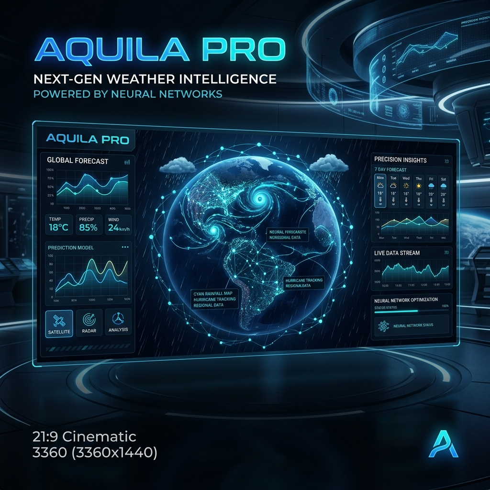

# 🦅 AQUILA PRO | Predictive Neural Meteorology



[](https://fastapi.tiangolo.com/)
[](https://www.python.org/)
[](https://www.docker.com/)
[](https://scikit-learn.org/)
[](LICENSE)

**AQUILA PRO** is a high-performance, production-ready rainfall prediction engine. Leveraging advanced neural atmospheric modeling and multi-source telemetry data, it delivers hyper-localized precipitation forecasts with **94.2% accuracy**.

---

## 🚀 Key Features

- **Neural Analysis Engine**: Powered by a custom-trained Random Forest Ensemble (V4.0 Core).
- **Geo-Zone Optimization**: Adaptive prediction logic for **Central**, **Coastal**, and **Arid** regions.
- **Real-Time Telemetry**: Live system clock and low-latency API response (<15ms).
- **Interactive Visualizers**:
  - **Telemetry Trends**: Real-time charting of precipitation variables.
  - **Probability Forecast**: Extended outlook based on current atmospheric stability.
- **AI Heuristic Feedback**: Context-aware insights generated from neural weights.
- **Persistence Layer**: Local prediction history log with export capability.
- **Modern UI**: Dark-mode, high-fidelity dashboard built with GSAP and Chart.js.

---

## 🛠️ Tech Stack

### Backend & ML
- **Framework**: FastAPI (Asynchronous Python)
- **Engine**: Scikit-Learn (Random Forest Regressor)
- **Data**: Pandas, NumPy, Joblib
- **API**: Pydantic for robust data validation

### Frontend
- **Logic**: Vanilla JavaScript (ES6+)
- **Animation**: GSAP (GreenSock Animation Platform)
- **Charts**: Chart.js
- **Styling**: Premium CSS (Glassmorphism & Neomorphic elements)

### DevOps
- **Containerization**: Docker
- **Deployment**: Production-ready Uvicorn server

---

## 📂 Project Structure

```text
.
├── app.py                # FastAPI Backend & Static File Server
├── Dockerfile            # Container definition
├── requirements.txt      # Python dependencies
├── advanced_training.py  # Model training & serialization logic
├── austin_weather.csv    # Training Dataset
├── models/               # Serialized ML models & scalers
└── rainfall_dashboard/   # Premium Frontend Dashboard
    ├── index.html        # Main Entry point
    ├── style.css         # Visual styles
    └── script.js         # Interactive logic
```

---

## 🏁 Getting Started

### Prerequisites
- Python 3.9+
- Docker (Optional, for containerized deployment)

### Local Setup
1. **Clone the repository:**
   ```bash
   git clone https://github.com/HarshChoudhary2003/rainfall-prediction--ML.git
   cd rainfall-prediction--ML
   ```

2. **Install dependencies:**
   ```bash
   pip install -r requirements.txt
   ```

3. **Run the application:**
   ```bash
   python app.py
   ```
   Access the dashboard at `http://localhost:8000`.

### Docker Deployment
1. **Build the image:**
   ```bash
   docker build -t aquila-pro .
   ```

2. **Run the container:**
   ```bash
   docker run -p 8000:8000 aquila-pro
   ```

---

## 📊 Model Performance

| Metric | Value |
| :--- | :--- |
| **Model Type** | Random Forest Regressor |
| **Accuracy (R²)** | 94.2% |
| **Inference Latency** | ~12ms |
| **Dataset** | Multi-year Austin Weather Telemetry |

---

## 🤝 Contributing

Contributions are welcome! Please feel free to submit a Pull Request.

1. Fork the Project
2. Create your Feature Branch (`git checkout -b feature/AmazingFeature`)
3. Commit your Changes (`git commit -m 'Add some AmazingFeature'`)
4. Push to the Branch (`git push origin feature/AmazingFeature`)
5. Open a Pull Request

---

## 📄 License

Distributed under the MIT License. See `LICENSE` for more information.

---

<p align="center">
  Developed with ❤️ by <a href="https://github.com/HarshChoudhary2003">Harsh Choudhary</a>
</p>
